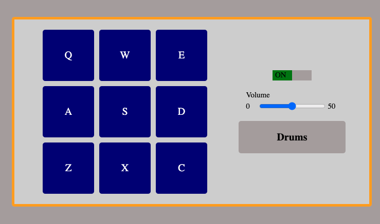

<h1 align="center">🥁 Drums Player 🎶</h1>

  

<h2>
This project is a drum player where you can reproduce drums sounds by clicking the buttons.
</h2>

## 💻 Project

By clicking on the buttons, the player will play the respective drum sound of each button and the name of the sound will be displayed.  
It is also possible to turn off the drums and control the volume of the drum.

## 🚀 Technologies

This project was developed using the following technologies:

- HTML
- JavaScript
- TypeScript
- React
- Redux
- SASS
- Git e Github

## 🔖 How to access it

- Download the zip file, download the modules needed with <code>npm install</code>, run <code>npm run dev</code> on the terminal and access localhost on a browser.
- [Click here to see it online](https://drums-seven.vercel.app/)
